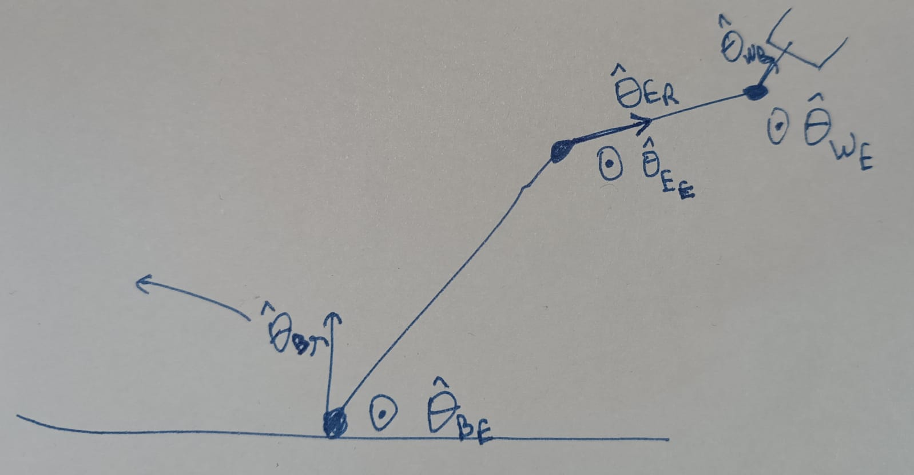

# Robotic_Arm
The Vicharaka Rover Codes for ROBOT ARM

# Vicharika-URC

## Arm Scematics

## Motor variables

| Joint Name      | Joint Angle Variable | Motor Type                      | Motor Torque (N-m) | Reduction Variable | Reduction Ratio | Reduction Type           |
| --------------- | -------------------- | ------------------------------- | ------------------ | ------------------ | --------------- | ------------------------ |
| Base Rotation   | theta_BR             | Nema 24 (Stepper)               | 4.2                | G_BR               | 10              | Timing Belt              |
| Base Elevation  | theta_BE             | Nema 24 (Stepper)               | 4.2                | G_BE               | 120             | Cycloidal(30)+Belt(4)    |
| Elbow Elevation | theta_EE             | Nema 24 (Stepper)               | 4.2                | G_EE               | 60              | Cycloidal(20)+Belt(3)    |
| Elbow Rotation  | theta_ER             | Nema 17 (Stepper) (geared 19:1) | 6                  | G_ER               | 95              | Inverted Timing Belt (5) |
| Wrist Elevation | theta_WE             | DC Motor (geared)               | 25.5               | G_WE               | 5               | Belt(5)                  |
| Wrist Rotation  | theta_WR             | Servo 150kg                     | 15                 | G_WR               | 1               | NA                       |
 