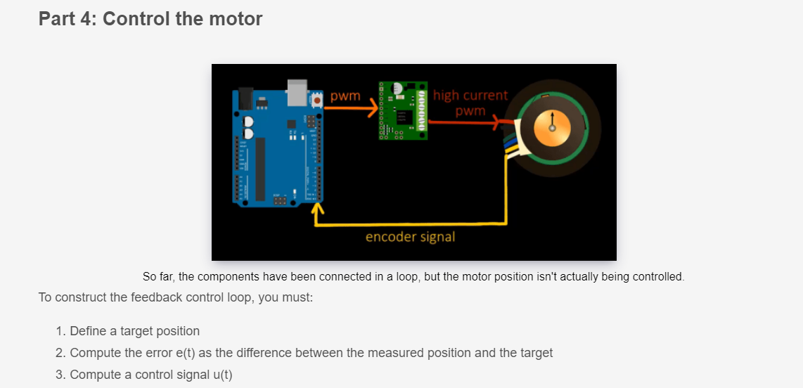

### Tutorial followed: https://www.youtube.com/watch?v=dTGITLnYAY0


```c++

//encoder test code 

#define ENCA 2 // Yellow
#define ENCB 3 // White

void setup() {
  Serial.begin(9600);
  pinMode(ENCA,INPUT);
  pinMode(ENCB,INPUT);
}

void loop() {
  int a = digitalRead(ENCA);
  int b = digitalRead(ENCB);
  Serial.print(a*5); 
  Serial.print(" ");
  Serial.print(b*5);
  Serial.println();
}

```

## Part 2: Measure position


When measuring position you don't want to read from the DO pins in the loop function. Instead, you want to trigger a function each time output A rises, and then increment the position. The code below triggers an interrupt when A rises, and then either adds one to the position (if output B is high) or subtracts one (if output B is low).
In order to ensure that the posi variable is stored so that it can be accurately read by both the loop and interrupt functions, you need to use the volatile qualifier. The volatile keyword prevents the compiler from performing optimizations on the variable that could potentially lead to it being misread. In addition to the volatile directive, an ATOMIC_BLOCK macro is needed to access the position variable. The ATOMIC_BLOCK macro prevents the interrupt from changing part of the posi variable while it is being read. Without the ATOMIC_BLOCK macro, it is possible for the interrupt to change part of the posi while it is being read, leading to a completely different reading of the variable.

```c++

// position finding code

#include <util/atomic.h> // For the ATOMIC_BLOCK macro

#define ENCA 2 // YELLOW
#define ENCB 3 // WHITE

volatile int posi = 0; // specify posi as volatile

void setup() {
  Serial.begin(9600);
  pinMode(ENCA,INPUT);
  pinMode(ENCB,INPUT);
  attachInterrupt(digitalPinToInterrupt(ENCA),readEncoder,RISING);
}

void loop() {
  // Read the position in an atomic block to avoid a potential
  // misread if the interrupt coincides with this code running
  // see: https://www.arduino.cc/reference/en/language/variables/variable-scope-qualifiers/volatile/
  int pos = 0; 
  ATOMIC_BLOCK(ATOMIC_RESTORESTATE) {
    pos = posi;
  }
  
  Serial.println(pos);
}

void readEncoder(){
  int b = digitalRead(ENCB);
  if(b > 0){
    posi++;
  }
  else{
    posi--;
  }
}```

Part 3: Drive the motor


```c++

#include <util/atomic.h> // For the ATOMIC_BLOCK macro

#define ENCA 2 // YELLOW
#define ENCB 3 // WHITE
#define PWM 5
#define IN2 6
#define IN1 7

volatile int posi = 0; // specify posi as volatile: https://www.arduino.cc/reference/en/language/variables/variable-scope-qualifiers/volatile/

void setup() {
  Serial.begin(9600);
  pinMode(ENCA,INPUT);
  pinMode(ENCB,INPUT);
  attachInterrupt(digitalPinToInterrupt(ENCA),readEncoder,RISING);
  
  pinMode(PWM,OUTPUT);
  pinMode(IN1,OUTPUT);
  pinMode(IN2,OUTPUT);
}

void loop() {
  
  // Read the position in an atomic block to avoid a potential
  // misread if the interrupt coincides with this code running
  // see: https://www.arduino.cc/reference/en/language/variables/variable-scope-qualifiers/volatile/
  int pos = 0; 
  ATOMIC_BLOCK(ATOMIC_RESTORESTATE) {
    pos = posi;
  }

  setMotor(1, 25, PWM, IN1, IN2);
  delay(200);
  Serial.println(pos);
  setMotor(-1, 25, PWM, IN1, IN2);
  delay(200);
  Serial.println(pos);
  setMotor(0, 25, PWM, IN1, IN2);
  delay(20);
  Serial.println(pos);
}

void setMotor(int dir, int pwmVal, int pwm, int in1, int in2){
  analogWrite(pwm,pwmVal);
  if(dir == 1){
    digitalWrite(in1,HIGH);
    digitalWrite(in2,LOW);
  }
  else if(dir == -1){
    digitalWrite(in1,LOW);
    digitalWrite(in2,HIGH);
  }
  else{
    digitalWrite(in1,LOW);
    digitalWrite(in2,LOW);
  }
}

void readEncoder(){
  int b = digitalRead(ENCB);
  if(b > 0){
    posi++;
  }
  else{
    posi--;
  }
}
```




```c++
#include <util/atomic.h> // For the ATOMIC_BLOCK macro

#define ENCA 2 // YELLOW
#define ENCB 3 // WHITE
#define PWM 5
#define IN2 6
#define IN1 7

volatile int posi = 0; // specify posi as volatile: https://www.arduino.cc/reference/en/language/variables/variable-scope-qualifiers/volatile/
long prevT = 0;
float eprev = 0;
float eintegral = 0;

void setup() {
  Serial.begin(9600);
  pinMode(ENCA,INPUT);
  pinMode(ENCB,INPUT);
  attachInterrupt(digitalPinToInterrupt(ENCA),readEncoder,RISING);
  
  pinMode(PWM,OUTPUT);
  pinMode(IN1,OUTPUT);
  pinMode(IN2,OUTPUT);
  
  Serial.println("target pos");
}

void loop() {

  // set target position
  //int target = 1200;
  int target = 250*sin(prevT/1e6);

  // PID constants
  float kp = 1;
  float kd = 0.025;
  float ki = 0.0;

  // time difference
  long currT = micros();
  float deltaT = ((float) (currT - prevT))/( 1.0e6 );
  prevT = currT;

  // Read the position in an atomic block to avoid a potential
  // misread if the interrupt coincides with this code running
  // see: https://www.arduino.cc/reference/en/language/variables/variable-scope-qualifiers/volatile/
  int pos = 0; 
  ATOMIC_BLOCK(ATOMIC_RESTORESTATE) {
    pos = posi;
  }
  
  // error
  int e = pos - target;

  // derivative
  float dedt = (e-eprev)/(deltaT);

  // integral
  eintegral = eintegral + e*deltaT;

  // control signal
  float u = kp*e + kd*dedt + ki*eintegral;

  // motor power
  float pwr = fabs(u);
  if( pwr > 255 ){
    pwr = 255;
  }

  // motor direction
  int dir = 1;
  if(u<0){
    dir = -1;
  }

  // signal the motor
  setMotor(dir,pwr,PWM,IN1,IN2);


  // store previous error
  eprev = e;

  Serial.print(target);
  Serial.print(" ");
  Serial.print(pos);
  Serial.println();
}

void setMotor(int dir, int pwmVal, int pwm, int in1, int in2){
  analogWrite(pwm,pwmVal);
  if(dir == 1){
    digitalWrite(in1,HIGH);
    digitalWrite(in2,LOW);
  }
  else if(dir == -1){
    digitalWrite(in1,LOW);
    digitalWrite(in2,HIGH);
  }
  else{
    digitalWrite(in1,LOW);
    digitalWrite(in2,LOW);
  }  
}

void readEncoder(){
  int b = digitalRead(ENCB);
  if(b > 0){
    posi++;
  }
  else{
    posi--;
  }
}
```